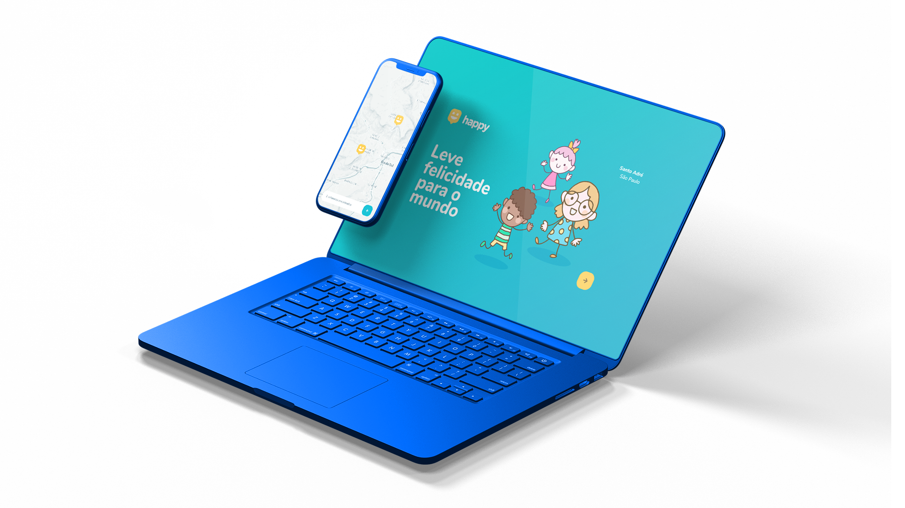

# Happy

Aplicação para facilitar a adoção de crianças.

Permite que cadastre casas de acolhimento institucional para facilitar a localização e demais informações para quem procurar alegrar o dia de uma criança ou até mesmo adotá-la.

## 🚀 Tecnologias

Esse projeto foi desenvolvido com as seguintes tecnologias:

- [Node.js](https://nodejs.org/en/)
- [Express](https://expressjs.com/pt-br/)
- [SQLite](https://www.sqlite.org/index.html)
- [Handlebars](https://handlebarsjs.com/)

## 📍 Onde me encontrar?

**Twitter** – [@danielsmota](https://twitter.com/danielsmota) 
**Linkedin** – [Daniel Mota](https://www.linkedin.com/in/danielsmota/) 
**Github** – [danielsmota](https://github.com/danielsmota)

## 🦄 Fique a vontade para colaborar e melhorar!

---

Projeto feito por **Daniel Mota** durante a **Next Level Week**. Evento realizado pela [RocketSeat](https://rocketseat.com.br/)
